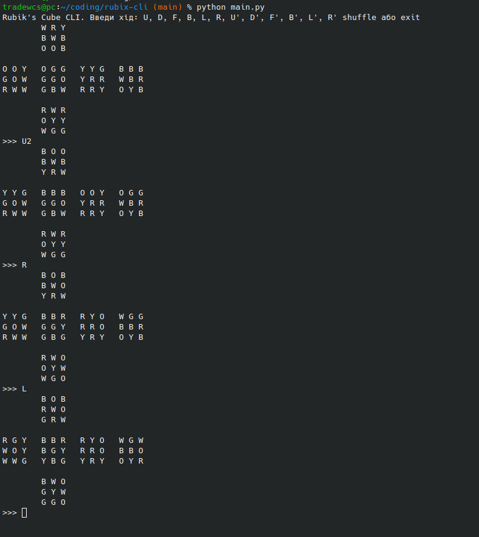

# Rubik's Cube CLI

Welcome to **Rubik's Cube CLI** 🎲 – a simple but fun command-line tool for simulating a Rubik's cube in Python. Twist and turn the faces of the cube directly from your terminal and challenge yourself to solve it!

---



## 🚀 Features

- Fully simulated 3x3 Rubik's cube.
- Supports all standard face moves (U, D, F, B, L, R) and their variations (prime, double turns).
- Middle layer and whole-cube rotations (M, S, E, X, Y, Z) included.
- Shuffle functionality for random scrambling.
- Visual ASCII representation of the cube state.
- Move counter and timer to track your solving performance.

## 🛠️ Getting Started

### Requirements

- Python 3.8+ (any modern version should work).

### Installation

```bash
git clone https://github.com/yourusername/rubix-cli.git
cd rubix-cli
# (Optionally create/activate a virtualenv)
python main.py
```

### Usage

Run the CLI and enter moves when prompted:

```
Rubik's Cube CLI. Введи хід: U, D, F, B, L, R, U', D', F', B', L', R' shuffle або exit
```

Moves may include:
- `U`, `D`, `F`, `B`, `L`, `R` – clockwise face turns
- Add `'` for counterclockwise (e.g. `U'`)
- Add `2` for a double turn (e.g. `R2`)
- Middle layer: `M`, `S`, `E` (and variants)
- Whole cube rotations: `X`, `Y`, `Z`
- `shuffle` to scramble the cube
- `exit` to quit

### Solving

Enter moves one at a time and watch the ASCII cube update. When the cube is solved, the CLI congratulates you and shows your time and move count.

## 📂 Project Structure

```
main.py       # core logic and CLI interface
README.md     # this documentation
```

## 🧩 Extending the Project

- Add support for algorithms or solving hints.
- Implement saving/loading cube states.
- Create a GUI or web front-end.

## 📄 License

MIT License – feel free to fork and improve!

---
Made by tradewcs
